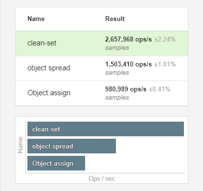

# clean-set

[](https://github.com/prettier/prettier)
[](https://travis-ci.org/fwilkerson/clean-set)
[](https://codecov.io/gh/fwilkerson/clean-set)

> Quickly update a value in a deeply nested object and clone each node touched for simple change tracking `===`.

```javascript
let current = {
	a: {
		b: [],
		c: true,
	},
	d: [],
	e: {
		f: {
			g: 'hello',
		},
		h: {
			i: 0,
		},
	},
};

let next = cleanSet(current, 'e.h.i', 1);

/**
 * Alternatively you can provide a function for the final parameter to
 * receive the current value of that node.
 *
 * let next = cleanSet(current, 'e.h.i', i => i + 1);
 */

// The value is assigned
console.log(next.e.h.i !== current.e.h.i); // true

// Each parent node touched is a new reference
console.log(next.e.h !== current.e.h); // true
console.log(next.e !== current.e); // true
console.log(next !== current); // true

// Untouched references remain the same
console.log(next.e.f === current.e.f); // true
console.log(next.a === current.a); // true
console.log(next.a.b === current.a.b); // true
console.log(next.d === current.d); // true
```

Here's what an object spread equivalent would look like.

```javascript
let next = {
	...current,
	e: {
		...current.e,
		h: {
			...current.h,
			i: 1,
		},
	},
};
```

## Benchmarks

Check out the [es bench link](https://esbench.com/bench/5b16f1cbf2949800a0f61cf2) to run the benchmarks yourself.

Chrome 67


